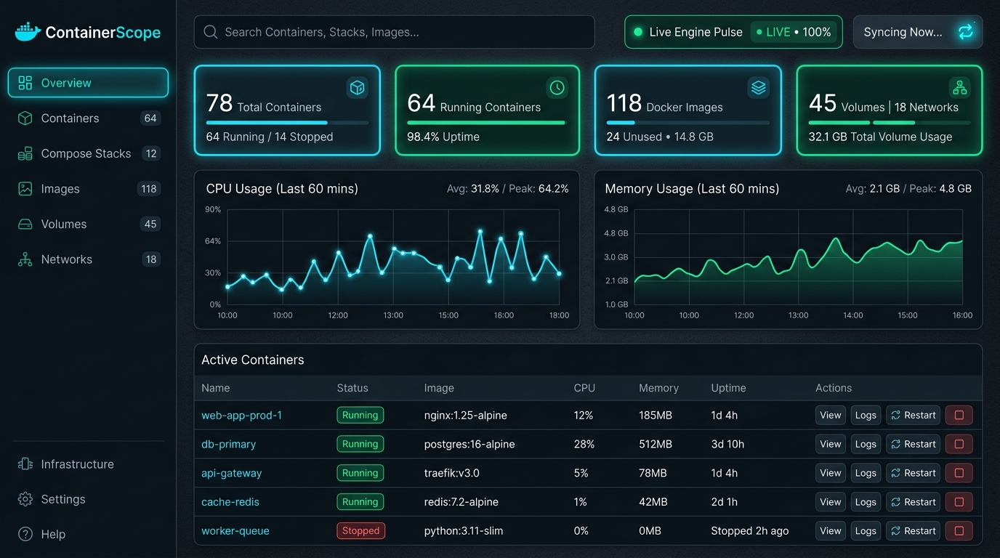
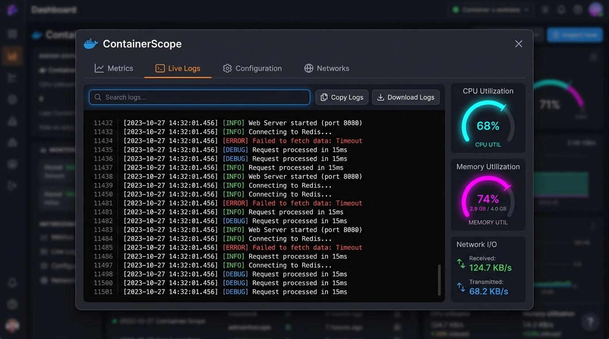

<div align="center">

# ⚡ ContainerScope
### Modern, Yüksek Performanslı ve Gerçek Zamanlı Docker İstihbarat & Yönetim Platformu

<p align="center">
  <strong>Docker altyapınızı hafif, modern, karanlık mod ve sıfır gecikmeli arayüzle izleyin ve yönetin.</strong>
</p>

[](LICENSE)
[](https://dotnet.microsoft.com/)
[](https://react.dev/)
[](https://www.typescriptlang.org/)
[](https://docs.docker.com/engine/api/)
[](https://vitejs.dev/)

<br />



<br />
<br />

[✨ Özellikler](#-öne-çıkan-özellikler) •
[📸 Görsel Vitrin](#-ekran-görüntüleri) •
[🏗️ Mimari](#-sistem-mimarisi) •
[🚀 Hızlı Başlangıç](#-kurulum-ve-çalıştırma) •
[📡 API Rehberi](#-rest-api-referansı) •
[🗺️ Yol Haritası](#-yol-haritası)

</div>

---

## 🌟 Neden ContainerScope?

Ağır ve hantal yönetim araçlarına alternatif olarak geliştirilen **ContainerScope**; Docker daemon soketine (`npipe` veya `unix:///var/run/docker.sock`) doğrudan, asenkron ve mikro-saniye gecikmeyle bağlanır. Siberpunk grafit teması, canlı metrik sayaçları, anlık terminal log akışı ve Docker Compose desteği ile konteyner filo yönetimini keyifli hale getirir.

---

## ✨ Öne Çıkan Özellikler

| Özellik | Simge | Detaylı Açıklama |
| :--- | :---: | :--- |
| **Anlık Filo İzleme** | 📊 | Çalışan ve durdurulan konteyner oranları, imaj disk boyutları ve kaynak dağılımı. |
| **Konteyner Yaşam Döngüsü** | ⚡ | Tek tıkla konteynerleri **Başlat (Start)**, **Durdur (Stop)**, **Yeniden Başlat (Restart)** ve **Kalıcı Olarak Sil (Remove)**. |
| **Canlı CPU & RAM Metrikleri** | 📈 | Docker motorundan okunan canlı CPU kullanım yüzdesi, RAM bellek tüketimi/limiti ve anlık Network I/O (RX/TX). |
| **Canlı Terminal Log Konsolu** | 💻 | `stdout`/`stderr` akışlarını zaman damgalarıyla izleme, anahtar kelime arama, satır filtreleme, panoya kopyalama ve `.txt` indirme. |
| **Docker Compose Orkestrasyonu** | 📦 | Etiketlerden (`com.docker.compose`) otomatik algılanan çoklu servis yığınlarını (Stacks) proje bazlı gruplama ve yönetme. |
| **Derin Kaynak İnceleme** | 🔍 | Ortam değişkenleri (Environment Variables), port yönlendirmeleri, volume mount dizinleri ve ağ IPAM ayarları. |
| **Akıllı Üst Arama Çubuğu** | 🔎 | Konteyner adı, imaj etiketi, hash ID, port veya ağ adına göre anında canlı filtreleme. |
| **Otomatik Senkronizasyon** | 🔄 | Arka planda `5s`, `10s`, `30s` periyotlarla otomatik veri yenileme veya manuel senkronizasyon. |
| **Bildirim Sistemi (Toast Alerts)** | 🔔 | Yapılan her işlemde ekranın sağ altında beliren renkli, modern geri bildirim alertleri. |

---

## 📸 Ekran Görüntüleri

### 🖥️ 1. Genel Bakış & Altyapı Paneli (Dashboard)
> Konteyner filosu, çalışma yüzdeleri, depolama dağılımları ve hızlı aksiyon butonlarını içeren ana kumanda merkezi.

<div align="center">
  
</div>

<br />

### 🔬 2. Konteyner Detay İnceleme & Canlı Log Konsolu (Inspect & Logs)
> CPU / RAM canlı göstergeleri, siyah terminal konsolu, ortam değişkenleri ve ağ/bağlantı noktası haritası.

<div align="center">
  
</div>

---

## 🏗️ Sistem Mimarisi

```
ContainerScope/
├── 🌐 backend/
│   └── ContainerScope.Api/     # ASP.NET Core 8 Web API
│       ├── Controllers/        # DockerController REST Uç Noktaları
│       ├── Services/           # DockerService (Docker.DotNet Entegrasyonu)
│       ├── Models/             # İnceleme, İstatistik ve DTO Modelleri
│       └── Dockerfile          # Çok Aşamalı .NET 8 Üretim İmajı
├── 🎨 frontend/                # React 19 + TypeScript + Vite
│   ├── src/
│   │   ├── components/         # Sidebar, Topbar, ContainerModal
│   │   ├── context/            # ToastNotification Sistemi
│   │   ├── pages/              # Dashboard, Containers, Compose, Images, Volumes, Networks
│   │   ├── services/           # dockerApi HTTP İstemcisi
│   │   ├── types/              # Güçlü Docker TypeScript Tanımları
│   │   └── App.css             # Siberpunk Dark Mode Tasarım Sistemi
│   ├── nginx.conf              # Nginx Ters Vekil (Reverse Proxy) Ayarları
│   └── Dockerfile              # Çok Aşamalı Nginx/React Üretim İmajı
├── 📁 docs/
│   └── screenshots/            # Önizleme ve Vitrin Görselleri
└── 🐳 docker-compose.yml       # Tek Komutla Docker Soket Bağlantılı Çalıştırma
```

---

## 🚀 Kurulum ve Çalıştırma

### Yöntem 1: Docker Compose ile Tek Komutla Çalıştırma (Önerilen) 🐳

Sisteminizde Docker Desktop veya Docker Engine kuruluysa projeyi saniyeler içinde ayağa kaldırabilirsiniz:

```bash
# 1. Depoyu klonlayın
git clone https://github.com/ismaildundar42/Docker-Management-Dashboard.git
cd Docker-Management-Dashboard

# 2. Servisleri derleyin ve arka planda başlatın
docker compose up -d --build
```

Tarayıcınızdan erişin:
* 🌐 **Frontend Dashboard:** [http://localhost:3000](http://localhost:3000)
* 📡 **Backend API Swagger:** [http://localhost:5000/swagger](http://localhost:5000/swagger)

---

### Yöntem 2: Lokal Geliştirme Ortamı (Development) 💻

#### Gereksinimler
* [.NET 8.0 SDK](https://dotnet.microsoft.com/download/dotnet/8.0)
* [Node.js 18+](https://nodejs.org/)
* [Docker Desktop](https://www.docker.com/products/docker-desktop/) (Çalışır durumda)

#### 1. Backend API'yi Başlatın
```bash
cd backend/ContainerScope.Api
dotnet run
```
*API varsayılan olarak `https://localhost:7160` veya `http://localhost:5000` portundan dinlemeye başlayacaktır.*

#### 2. Frontend Arayüzünü Başlatın
```bash
cd frontend
npm install
npm run dev
```
*Vite geliştirme sunucusu `http://localhost:5173` adresinde anlık kod yenileme (HMR) ile açılacaktır.*

---

## 📡 REST API Referansı

| Uç Nokta (Endpoint) | Metot | Açıklama |
| :--- | :---: | :--- |
| `/api/docker/containers` | `GET` | Tüm konteynerleri listeler (Aktif ve Pasif) |
| `/api/docker/containers/{id}/inspect` | `GET` | Konteynerin detaylı yapılandırma ve durum bilgilerini döner |
| `/api/docker/containers/{id}/start` | `POST` | Belirtilen konteyneri başlatır |
| `/api/docker/containers/{id}/stop` | `POST` | Belirtilen konteyneri durdurur |
| `/api/docker/containers/{id}/restart` | `POST` | Belirtilen konteyneri yeniden başlatır |
| `/api/docker/containers/{id}` | `DELETE` | Konteyneri siler (`?force=true` zorla silme desteği) |
| `/api/docker/containers/{id}/logs` | `GET` | Konteynerin stdout/stderr loglarını getirir (`?tail=150`) |
| `/api/docker/containers/{id}/stats` | `GET` | Canlı CPU %, RAM kullanımı/limiti ve Ağ I/O metriklerini hesaplar |
| `/api/docker/compose/stacks` | `GET` | Docker Compose ile etiketlenmiş proje yığınlarını gruplar |
| `/api/docker/images` | `GET` | Yerel Docker imajlarını ve boyutlarını listeler |
| `/api/docker/images/{id}/inspect` | `GET` | İmaj katmanları ve detaylarını döner |
| `/api/docker/volumes` | `GET` | Kalıcı veri hacimlerini (Volumes) listeler |
| `/api/docker/volumes/{name}/inspect` | `GET` | Hacim bağlama noktası ve driver detaylarını döner |
| `/api/docker/networks` | `GET` | Sanal ağları (Bridge, Host, vb.) listeler |
| `/api/docker/networks/{id}/inspect` | `GET` | Ağ IPAM ve bağlı konteyner detaylarını döner |

---

## 🗺️ Yol Haritası (Roadmap)

- [x] Modern Dark Mode ve Siberpunk Görsel Tasarım Sistemi
- [x] Konteyner Başlatma / Durdurma / Yeniden Başlatma / Silme
- [x] Canlı Terminal Log İzleyici & Log Arama/İndirme
- [x] Canlı CPU & RAM Kullanım Göstergeleri
- [x] Docker Compose Çoklu Servis Yığınları (Stacks) Görünümü
- [x] İmaj, Volume ve Sanal Ağ Yönetim Sayfaları
- [x] Çok Aşamalı Dockerfile ve `docker-compose.yml` Dağıtımı
- [ ] Konteyner İçi Canlı Terminal (Interactive Web Terminal / Exec Sh)
- [ ] Docker Hub üzerinden İmaj Çekme (Pull Image) Arayüzü
- [ ] Konteyner Kaynak Limitleme (CPU/RAM Limit Güncelleme)

---

## 🤝 Katkıda Bulunma

1. Depoyu Fork'layın (`fork`)
2. Özellik dalınızı oluşturun (`git checkout -b feature/harika-ozellik`)
3. Değişikliklerinizi commit edin (`git commit -m 'feat: harika ozellik eklendi'`)
4. Dalınıza push yapın (`git push origin feature/harika-ozellik`)
5. Bir **Pull Request** açın

---

## 📄 Lisans

Bu proje **MIT Lisansı** altında lisanslanmıştır. Detaylar için [`LICENSE`](LICENSE) dosyasına göz atabilirsiniz.

<div align="center">
  <sub>❤️ ile geliştirildi — <strong>ContainerScope</strong></sub>
</div>
